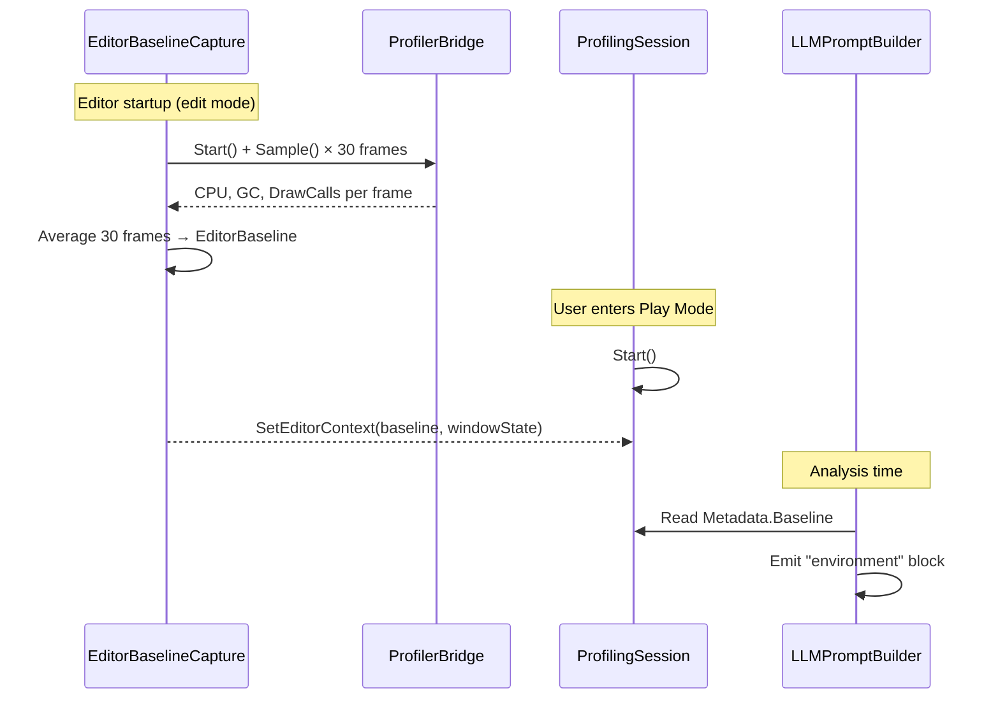
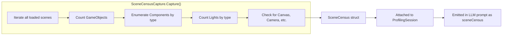
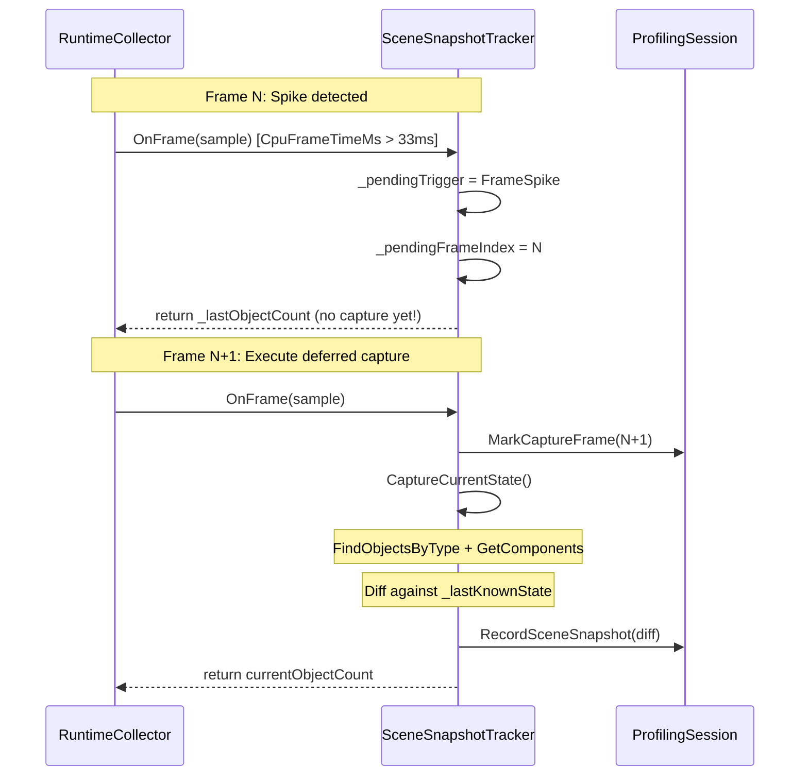

# DrWario LLM Context: Deep Dive

> A comprehensive study of what data DrWario sends to the LLM, how it's structured, how scene hierarchy and memory layout are shared, and how optimized the context is.

---

## Overview: What Gets Sent

DrWario constructs a two-part prompt for every AI interaction:

```
┌─────────────────────────────┐
│      System Prompt          │  ← Who you are, what format to use
│  (static + AdditionalCtx)   │
├─────────────────────────────┤
│      User Prompt            │  ← All profiling data as JSON
│  (dynamic, per-session)     │
│                             │
│  ┌── session metadata      │
│  ├── environment context   │
│  ├── frame summary stats   │
│  ├── memory trajectory     │
│  ├── boot pipeline         │
│  ├── asset loads            │
│  ├── profiler markers      │
│  ├── extended counters     │
│  ├── scene census          │
│  ├── scene snapshots       │  ← hierarchy diffs
│  └── pre-analysis findings │
│                             │
└─────────────────────────────┘
```

The entire prompt is built by `LLMPromptBuilder` (`Editor/Analysis/LLM/LLMPromptBuilder.cs`).

---

## 1. System Prompt

### Content

The system prompt establishes the LLM's role and output format:

```
You are an expert Unity performance analyst.

Your task: Analyze the profiling session data and return findings as a JSON array.
Each finding object must have these exact fields:
- ruleId (string): unique identifier prefixed with "AI_"
- category (string): one of "CPU", "Memory", "Boot", "Assets", "Network"
- severity (string): one of "Critical", "Warning", "Info"
- title (string): short summary
- description (string): detailed explanation with data references
- recommendation (string): actionable fix with specific code patterns
- metric (number): the measured value
- threshold (number): the reference threshold
- scriptPath (string, optional): relative Unity asset path to the script causing the issue
- scriptLine (int, optional): line number in the script
- assetPath (string, optional): relative Unity asset path to a related asset
```

### Editor-Awareness Guidance

The system prompt includes explicit instructions for handling editor sessions:

```
IMPORTANT: When session data is from the Unity Editor (environment.isEditor=true),
editor overhead inflates all metrics. The editorBaseline provides idle editor overhead
measured before Play Mode. Use these to estimate actual game performance:
- CPU time: subtract ~baseline.avgCpuFrameTimeMs from measured values
- GC allocations: subtract ~baseline.avgGcAllocBytes per frame
- Draw calls: subtract ~baseline.avgDrawCalls (especially if Scene view is open)
```

### Scene Census Guidance

```
When scene census data is provided (sceneCensus), consider scene composition:
- Too many point/spot lights without baking → recommend light baking
- Missing LOD groups on high-poly meshes → recommend adding LOD groups
- Excessive particle systems → recommend pooling
- Many rigidbodies without sleeping → recommend adjusting sleep thresholds
```

### Profiler Marker Guidance

```
When profilerMarkers data is available, reference specific marker names in your
findings rather than guessing which subsystem is expensive. Use the marker timing
data to attribute frame budget usage.
```

### AdditionalContext Injection

External frameworks (like HybridFrame) can inject domain-specific context:

```csharp
// In HybridFrame's DrWarioIntegration.cs:
LLMPromptBuilder.AdditionalContext = @"
This is a HybridFrame project using ECS architecture with:
- VContainer for dependency injection
- YooAsset for asset management
- KCP for networking
Boot pipeline: Launcher → VContainer → YooAsset → Scene Loading → Ready
";
```

This gets appended to the system prompt as `Additional project context:`.

---

## 2. Session Metadata

**What it tells the LLM:** Platform, Unity version, resolution, target FPS, session duration.

```json
"session": {
  "startTime": "2026-03-09T10:30:00.0000000Z",
  "endTime": "2026-03-09T10:31:02.3000000Z",
  "durationSeconds": 62.3,
  "unityVersion": "2022.3.45f1",
  "platform": "WindowsEditor",
  "targetFrameRate": 60,
  "screenWidth": 1920,
  "screenHeight": 1080
}
```

**Why:** The LLM uses platform to give platform-specific advice (WebGL memory limits, mobile thermal throttling), Unity version for version-specific bugs, and target FPS to judge frame drop severity.

**Token cost:** ~80 tokens. Minimal.

---

## 3. Environment Context (Editor vs Build)

**What it tells the LLM:** Whether we're in editor, which editor windows are open, and the idle editor overhead baseline.

```json
"environment": {
  "isEditor": true,
  "isDevelopmentBuild": false,
  "editorWindows": {
    "sceneViewOpen": true,
    "inspectorOpen": true,
    "profilerOpen": false,
    "gameViewCount": 1
  },
  "editorBaseline": {
    "avgCpuFrameTimeMs": 4.2,
    "avgRenderThreadMs": 1.8,
    "avgGcAllocBytes": 3200,
    "avgGcAllocCount": 12,
    "avgDrawCalls": 45,
    "avgBatches": 38,
    "avgSetPassCalls": 15,
    "sampleCount": 30,
    "isValid": true
  },
  "note": "Data captured in Unity Editor Play Mode. Editor overhead (Scene view, Inspector, etc.)
           is included in measurements. Subtract baseline values for approximate game-only metrics."
}
```

**Why:** Without this, the LLM would treat editor overhead as game problems. The baseline lets the LLM estimate true game performance (e.g., "measured 8ms CPU - 4.2ms baseline = ~3.8ms actual game cost").

**How it's captured:** `EditorBaselineCapture` samples 30 frames during idle editor (before Play Mode) using `ProfilerBridge`. The baseline is attached to the session metadata via `ProfilingSession.SetEditorContext()`.



**Token cost:** ~150 tokens. Worth it — prevents false positive AI findings.

---

## 4. Frame Summary Statistics

**What it tells the LLM:** Statistical summary of all sampled frames — not raw frame data.

```json
"frameSummary": {
  "totalFrames": 3600,
  "cpuFrameTime": {
    "avg": 8.42,
    "p50": 7.85,
    "p95": 14.32,
    "p99": 22.67,
    "max": 48.91,
    "min": 5.12
  },
  "gpuFrameTime": {
    "avg": 6.21,
    "p95": 9.44,
    "max": 15.82
  },
  "renderThreadTime": {
    "avg": 3.44,
    "p95": 5.67,
    "max": 12.33
  },
  "rendering": {
    "drawCalls": { "avg": 342, "max": 891 },
    "batches": { "avg": 245, "max": 650 },
    "batchingEfficiency": 28.4,
    "setPassCalls": { "avg": 85, "max": 210 },
    "triangles": { "avg": 1250000, "max": 3200000 }
  },
  "gcAllocation": {
    "avgPerFrame": 2048,
    "maxPerFrame": 45056,
    "totalBytes": 7372800,
    "spikeCount": 127,
    "spikeThreshold": 1024
  },
  "gcAllocCount": {
    "avgPerFrame": 8.3,
    "maxPerFrame": 142,
    "totalAllocations": 29880
  },
  "frameDrops": {
    "count": 85,
    "severeCount": 3,
    "dropRatio": 0.0236,
    "targetMs": 16.67
  },
  "bottleneck": "CPU-bound"
}
```

**Key optimization:** We do NOT send 3600 individual frame samples. Instead, we compute statistical aggregates (avg, percentiles, min, max) and send those. This reduces ~100K tokens of raw data to ~200 tokens.

**How it works internally:**

```csharp
// In AppendFrameSummary():
var frames = session.GetFrames();  // 3600 FrameSample structs
var cpuTimes = frames.Select(f => f.CpuFrameTimeMs).OrderBy(t => t).ToArray();

// Compute P95 as sorted[length * 0.95]
float p95 = Percentile(cpuTimes, 0.95f);

// Bottleneck classification
if (avgGpu > avgCpu * 1.3f) bottleneck = "GPU-bound";
else if (avgCpu > avgGpu * 1.3f) bottleneck = "CPU-bound";
else bottleneck = "balanced";
```

**Token cost:** ~250 tokens. Highly efficient — summarizes 3600 frames.

---

## 5. Memory Trajectory

**What it tells the LLM:** How memory changed over the session — 12 downsampled points + linear regression for leak detection.

```json
"memoryTrajectory": {
  "samples": [
    { "timeOffset": 0.0, "heapMB": 128.4, "textureMB": 64.2, "meshMB": 22.1 },
    { "timeOffset": 5.2, "heapMB": 129.1, "textureMB": 64.2, "meshMB": 22.1 },
    { "timeOffset": 10.4, "heapMB": 131.8, "textureMB": 64.2, "meshMB": 22.1 },
    ...12 points total...
  ],
  "linearRegression": {
    "heapSlopeBytePerSec": 52428,
    "heapSlopeMBPerMin": 3.00
  },
  "currentBreakdown": {
    "totalHeapMB": 145.2,
    "textureMemoryMB": 64.2,
    "meshMemoryMB": 22.1
  }
}
```

**Downsampling strategy:** We take every `frames.Length / 12`th frame. For a 3600-frame session, that's every 300th frame — giving 12 evenly-spaced snapshots of heap, texture, and mesh memory.

**Linear regression:** Ordinary least squares on heap bytes over time. The slope tells the LLM "memory is growing at X MB/min" which directly indicates a memory leak.

```csharp
// OLS: slope = (n·ΣXY - ΣX·ΣY) / (n·ΣX² - (ΣX)²)
double slope = denom != 0 ? (n * sumXY - sumX * sumY) / denom : 0;
double slopeMBMin = slope / (1024.0 * 1024.0) * 60.0;
```

**Token cost:** ~200 tokens for 12 samples + regression. Very efficient.

---

## 6. Boot Pipeline

**What it tells the LLM:** How long each boot stage took and whether it succeeded.

```json
"bootPipeline": {
  "totalMs": 4250,
  "stages": [
    { "name": "VContainer.Init", "durationMs": 120, "success": true },
    { "name": "YooAsset.Initialize", "durationMs": 890, "success": true },
    { "name": "SceneLoading", "durationMs": 2100, "success": true },
    { "name": "NetworkConnect", "durationMs": 1140, "success": true }
  ]
}
```

**Only present when:** The game uses `BootTimingHook.OnStageComplete` to record boot stages. Otherwise `null`.

**Token cost:** ~50-100 tokens depending on stage count.

---

## 7. Asset Loads

**What it tells the LLM:** Slow asset loads (>500ms), with the top 10 slowest.

```json
"assetLoads": {
  "count": 47,
  "avgMs": 124,
  "maxMs": 2340,
  "totalMs": 5828,
  "slowLoads": [
    { "assetKey": "characters/hero_model", "durationMs": 2340 },
    { "assetKey": "environments/level_3", "durationMs": 1200 },
    { "assetKey": "audio/music_pack_01", "durationMs": 890 }
  ]
}
```

**Optimization:** We don't send all 47 loads — only count/avg/max aggregate + top 10 slowest over 500ms.

**Token cost:** ~80-120 tokens.

---

## 8. Profiler Markers (Subsystem Timing)

**What it tells the LLM:** Which Unity subsystems are consuming frame budget, with precise nanosecond timing.

```json
"profilerMarkers": [
  { "name": "PlayerLoop",         "avgInclusiveMs": 8.4, "avgExclusiveMs": 8.4, "maxInclusiveMs": 48.9, "avgCallCount": 1.0 },
  { "name": "Update",             "avgInclusiveMs": 3.2, "avgExclusiveMs": 3.2, "maxInclusiveMs": 18.1, "avgCallCount": 1.0 },
  { "name": "Rendering",          "avgInclusiveMs": 2.8, "avgExclusiveMs": 2.8, "maxInclusiveMs": 12.3, "avgCallCount": 1.0 },
  { "name": "Physics.Processing", "avgInclusiveMs": 1.1, "avgExclusiveMs": 1.1, "maxInclusiveMs": 5.2,  "avgCallCount": 1.0 },
  { "name": "FixedUpdate",        "avgInclusiveMs": 0.8, "avgExclusiveMs": 0.8, "maxInclusiveMs": 3.4,  "avgCallCount": 1.0 },
  { "name": "LateUpdate",         "avgInclusiveMs": 0.3, "avgExclusiveMs": 0.3, "maxInclusiveMs": 1.8,  "avgCallCount": 1.0 },
  { "name": "Animation.Update",   "avgInclusiveMs": 0.2, "avgExclusiveMs": 0.2, "maxInclusiveMs": 0.9,  "avgCallCount": 1.0 }
]
```

**How it works:** `RuntimeCollector` creates `ProfilerRecorder` instances for 7 key markers at session start. Each frame, it reads the recorder's `CurrentValue` (nanoseconds) and `Count`, accumulating totals. At session end, it computes averages, sorts by inclusive time descending, and keeps the top 20.

```csharp
// RuntimeCollector.StartMarkerRecorders()
var markerDefs = new (string name, ProfilerCategory category)[]
{
    ("PlayerLoop", ProfilerCategory.Internal),
    ("FixedUpdate", ProfilerCategory.Internal),
    ("Update", ProfilerCategory.Internal),
    ("LateUpdate", ProfilerCategory.Internal),
    ("Rendering", ProfilerCategory.Render),
    ("Physics.Processing", ProfilerCategory.Physics),
    ("Animation.Update", ProfilerCategory.Animation),
};

// Per frame: accumulate
ref var acc = ref _markerAccumulators[i];
long val = acc.recorder.CurrentValue;  // nanoseconds
acc.totalNs += val;
if (val > acc.maxNs) acc.maxNs = val;
acc.sampleCount++;
```

**Why this matters:** Without marker data, the LLM has to guess "your frame drops might be caused by physics or rendering." With markers, it can say "Physics.Processing averages 1.1ms (14% of frame budget) with a max of 5.2ms — this correlates with your frame spikes."

**Token cost:** ~120 tokens for 7 markers. High value per token.

---

## 9. Extended Subsystem Counters

**What it tells the LLM:** Physics, audio, animation, and UI subsystem statistics.

```json
"extendedCounters": {
  "physics": {
    "avgActiveBodies": 45,
    "avgKinematicBodies": 12,
    "avgContacts": 28,
    "maxContacts": 156
  },
  "audio": {
    "avgVoices": 8,
    "maxVoices": 24,
    "avgDSPLoad": 12.5
  },
  "animation": {
    "avgAnimators": 15,
    "maxAnimators": 22
  },
  "ui": {
    "avgCanvasRebuilds": 2.3,
    "maxCanvasRebuilds": 18,
    "avgLayoutRebuilds": 1.1,
    "maxLayoutRebuilds": 12
  }
}
```

**Conditional inclusion:** Each section is only included if any frame had non-zero data. An empty game with no physics won't waste tokens on `"physics": { "avgActiveBodies": 0 ... }`.

**Token cost:** ~80-120 tokens (only for active subsystems).

---

## 10. Scene Census (Static Snapshot)

**What it tells the LLM:** The composition of the scene at session start — how many objects, what types of components, how many lights, cameras, etc.

```json
"sceneCensus": {
  "totalGameObjects": 1247,
  "totalComponents": 3891,
  "componentDistribution": [
    { "type": "Transform", "count": 1247 },
    { "type": "MeshRenderer", "count": 342 },
    { "type": "MeshFilter", "count": 342 },
    { "type": "BoxCollider", "count": 128 },
    { "type": "Rigidbody", "count": 45 },
    { "type": "Animator", "count": 15 },
    { "type": "Canvas", "count": 3 },
    { "type": "ParticleSystem", "count": 8 }
  ],
  "lights": {
    "directional": 1,
    "point": 12,
    "spot": 4,
    "area": 0
  },
  "canvasCount": 3,
  "cameraCount": 2,
  "particleSystemCount": 8,
  "lodGroupCount": 0,
  "rigidbodyCount": 45,
  "rigidbody2DCount": 0
}
```

**How it's captured:** `SceneCensusCapture.Capture()` runs once before the profiling session starts. It iterates all loaded scenes, counts GameObjects, enumerates components by type (top 20 by count), counts lights by type, and checks for specific components (Canvas, Camera, ParticleSystem, LODGroup, Rigidbody).



**Why it matters:** The LLM can now reason about scene composition — "you have 12 point lights and 0 LOD groups but 342 mesh renderers. Consider adding LOD groups and baking some lights."

**Token cost:** ~150 tokens. Rich scene context.

---

## 11. Scene Snapshots (Hierarchy Diffs) — The Most Novel Feature

**What it tells the LLM:** How the scene hierarchy changed during profiling — what objects were added/removed, especially during performance spikes.

```json
"sceneSnapshots": {
  "baselineObjectCount": 1247,
  "finalObjectCount": 1398,
  "netGrowth": 151,
  "snapshotCount": 12,
  "topInstantiatedObjects": [
    { "name": "Bullet", "count": 89 },
    { "name": "ExplosionVFX", "count": 34 },
    { "name": "EnemyPrefab", "count": 28 }
  ],
  "spikeFrameDiffs": [
    { "frame": 423, "trigger": "GcSpike", "added": 15, "removed": 2, "total": 1302 },
    { "frame": 891, "trigger": "FrameSpike", "added": 8, "removed": 0, "total": 1350 }
  ]
}
```

### How Scene Diffs Are Captured

This is the most architecturally interesting part of DrWario's context pipeline. The challenge: capturing scene hierarchy data is expensive (`FindObjectsByType` + `GetComponents` causes GC allocations), but we need it at the exact moments when performance issues occur.

**Solution: Deferred diff-based capture with self-exclusion.**



**Key design decisions:**

1. **Deferred capture** — Trigger on frame N, capture on frame N+1. This way the expensive `FindObjectsByType`/`GetComponents` allocations happen on a *different* frame than the spike being measured, preventing DrWario from inflating the spike frame's GC.

2. **Diff-based storage** — We don't store full hierarchy snapshots. We keep one `_lastKnownState` dictionary (keyed by InstanceID) and compute diffs (added/removed objects) against it. Max 100 snapshots stored.

3. **Capture triggers:**
   - `Periodic` — every 60 frames (~1/second)
   - `FrameSpike` — CPU time exceeded 33.33ms
   - `GcSpike` — GC allocation exceeded 4096 bytes
   - `Baseline` — session start (full hierarchy, everything is "added")

4. **Object identity:** Each `SceneObjectEntry` stores:
   ```csharp
   public struct SceneObjectEntry
   {
       public int InstanceId;       // Unique per GameObject
       public string Name;          // e.g., "Bullet(Clone)"
       public int ParentInstanceId; // -1 for root objects
       public string[] ComponentTypes; // e.g., ["MeshRenderer", "BoxCollider"]
   }
   ```

### What Gets Sent to the LLM (Optimized)

We do NOT send all 100 raw snapshot diffs. Instead, the prompt builder computes:

1. **Baseline vs final count** — net object growth
2. **Top instantiated object names** — grouped by base name (stripping `(Clone)` suffix), sorted by count, top 10
3. **Spike-frame diffs only** — only snapshots triggered by `FrameSpike` or `GcSpike` with non-zero adds/removes

```csharp
// AppendSceneSnapshots() — optimization logic:

// 1. Summary counts
int netGrowth = last.TotalObjectCount - baseline.TotalObjectCount;

// 2. Group added objects by base name (strip "(Clone)")
var addedNames = new Dictionary<string, int>();
foreach (var snap in snapshots)
    foreach (var obj in snap.Added)
    {
        string baseName = obj.Name;
        int cloneIdx = baseName.IndexOf("(Clone)");
        if (cloneIdx > 0) baseName = baseName.Substring(0, cloneIdx).Trim();
        addedNames[baseName] = addedNames.GetValueOrDefault(baseName) + 1;
    }

// 3. Only include spike-triggered diffs (not periodic)
foreach (var snap in snapshots)
    if (snap.Trigger == SnapshotTrigger.FrameSpike || snap.Trigger == SnapshotTrigger.GcSpike)
        if (snap.Added.Length > 0 || snap.Removed.Length > 0)
            // include this diff
```

**Why this optimization matters:** Raw snapshot data could be thousands of tokens (100 snapshots × N objects each). The summarized version is ~100-150 tokens and contains exactly what the LLM needs to identify:
- Object churn ("89 Bullets were instantiated — consider pooling")
- Correlated spikes ("frame 423 had a GC spike AND 15 new objects were added — instantiation is causing GC")
- Memory leaks ("net growth of 151 objects — some objects aren't being destroyed")

**Token cost:** ~100-150 tokens. Extremely efficient for the insight density.

---

## 12. Pre-Analysis Findings

**What it tells the LLM:** The deterministic rule findings, so AI can build on them rather than repeat them.

```json
"preAnalysis": {
  "findingsCount": 5,
  "findings": [
    { "ruleId": "GC_SPIKE", "category": "Memory", "severity": "Warning", "confidence": "High", "title": "GC Allocation Spikes (127 frames)", "metric": 127.0, "threshold": 1024.0 },
    { "ruleId": "FRAME_DROP", "category": "CPU", "severity": "Info", "confidence": "Medium", "title": "Frame Drops (85 frames over 16.7ms)", "metric": 14.3, "threshold": 16.7 },
    { "ruleId": "RENDER_EFFICIENCY", "category": "Rendering", "severity": "Warning", "confidence": "High", "title": "High Draw Call Count", "metric": 342.0, "threshold": 200.0 }
  ]
}
```

**Why:** The LLM sees what the deterministic rules already found, including their confidence level. This lets it:
- Avoid repeating the same findings
- Build cross-cutting correlations ("your GC spikes AND frame drops are likely related because...")
- Add nuance the rules can't ("this GC pattern suggests your string concatenation in Update is the cause")

**Compact format:** Each finding is condensed to ruleId, category, severity, confidence, title, metric, threshold. Full descriptions are omitted to save tokens.

**Token cost:** ~30-50 tokens per finding.

---

## Complete Prompt Token Budget

Here's the approximate token cost for a typical 60-second profiling session:

| Section | Tokens | % of Total | Value Density |
|---------|--------|------------|---------------|
| System prompt | ~400 | 25% | Essential (role + format) |
| Session metadata | ~80 | 5% | Low but necessary |
| Environment context | ~150 | 9% | High (prevents false positives) |
| Frame summary | ~250 | 15% | Very high (3600 frames → 250 tokens) |
| Memory trajectory | ~200 | 12% | High (leak detection) |
| Boot pipeline | ~80 | 5% | Medium (if present) |
| Asset loads | ~100 | 6% | Medium (top 10 only) |
| Profiler markers | ~120 | 7% | Very high (subsystem attribution) |
| Extended counters | ~100 | 6% | Medium (conditional) |
| Scene census | ~150 | 9% | High (composition context) |
| Scene snapshots | ~120 | 7% | Very high (hierarchy diffs) |
| Pre-analysis | ~100 | 6% | High (avoids repetition) |
| **Total** | **~1650** | **100%** | |

**Compression ratio:** ~1650 tokens to represent a 60-second session with 3600 frames, 28 fields each, plus scene hierarchy, boot pipeline, asset loads, and pre-analysis findings. The raw data would be ~500K+ tokens. That's a **~300x compression ratio**.

---

## How Does the LLM Get Sequence/Change Context?

### It's Diffs, Not Full State

The LLM does NOT receive:
- Full frame-by-frame data (3600 × 28 fields)
- Full scene hierarchy at every snapshot
- Raw memory dumps

Instead, it receives:
- **Statistical aggregates** for frame data (avg, P50, P95, P99, max, min)
- **12 downsampled points** for memory trajectory (not 3600)
- **Hierarchy diffs** (added/removed objects, not full tree)
- **Top-N summaries** (top 10 slow assets, top 10 instantiated objects, top 20 markers)
- **Regression slopes** (heap growth rate, not absolute values)

### Temporal Context via Correlation

The LLM understands *when* things happened through:

1. **Spike-frame diffs** in `sceneSnapshots.spikeFrameDiffs` — "at frame 423 (GcSpike trigger), 15 objects were added"
2. **Memory trajectory samples** with `timeOffset` — shows memory at 12 points over the session
3. **Pre-analysis frame indices** — each finding references affected frames
4. **Boot pipeline ordering** — stages are listed in execution order with durations

### What the LLM Cannot See

- Individual frame data (only aggregates)
- Component values/properties (only type names)
- Script source code (only statistical summaries)
- Asset contents (only load timing + keys)
- Profiler callstacks (only marker names + timing)

This is intentional — privacy by design ("No source code sent").

---

## Optimization Opportunities

### Current Efficiencies

1. **Conditional sections** — Extended counters, boot pipeline, asset loads are only included when data exists
2. **Top-N capping** — Asset loads capped at top 10, markers at top 20, instantiated objects at top 10
3. **Diff-based snapshots** — Only added/removed objects, not full hierarchy
4. **Clone name grouping** — "Bullet(Clone)" × 89 becomes `{ "name": "Bullet", "count": 89 }` instead of 89 entries
5. **Spike-only diffs** — Periodic snapshot diffs are excluded from the LLM prompt (only spike-triggered ones)

### Potential Further Optimizations

1. **Adaptive detail** — Include more detail for sections that have findings. If GC is fine, compress the GC section. If rendering has issues, expand rendering detail.
2. **Delta-encoded memory** — Instead of 12 absolute values, send initial + 11 deltas (smaller numbers = fewer tokens)
3. **Frame range annotations** — Instead of spike frame diffs, annotate frame ranges ("frames 400-430: heavy instantiation period")
4. **Component type deduplication** — The scene census already does this with `componentDistribution`, but snapshot diffs could group by component signature rather than individual objects

---

*This document describes the LLM context as of v2.0 (2026-03-09). The prompt structure is defined in `Editor/Analysis/LLM/LLMPromptBuilder.cs`.*
